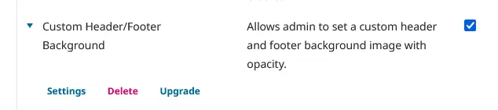
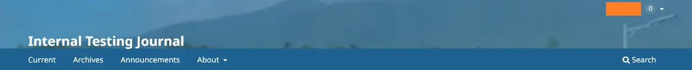
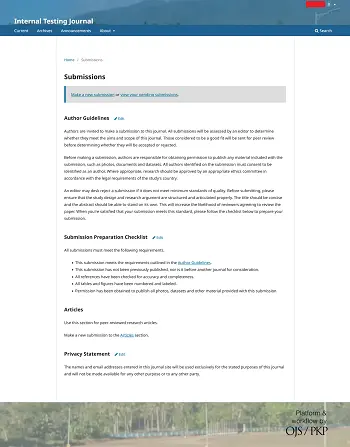
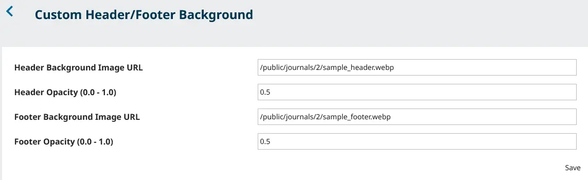

# OJS Custom Header/Footer Background Plugin

A lightweight, journal-isolated plugin for Open Journal Systems (OJS) 3.5+ that allows site administrators to set a custom background image and opacity for the header and footer sections of their journal.

## Features
- **Journal-Specific:** Settings are isolated per journal. You can customize your test journal without affecting your production site.
- **Non-Destructive Styling:** Uses CSS pseudo-elements to apply opacity to backgrounds without fading out your site's navigation, logos, or text.
- **Frontend-Safe:** Automatically applies to all public-facing pages while keeping the editorial backend clean.
- **Easy Configuration:** Includes a native OJS administrative settings modal for quick image URL and opacity updates.

## Sample output
Header:

Footer:

Full-size sample:

Live preview: *(To follow)*
## Installation

1. Download this repository and ensure the folder is renamed to `customHeadFoot`.
2. Upload the `customHeadFoot` folder to your OJS installation directory: `[OJS_ROOT]/plugins/generic/`.
3. Log in to your OJS installation as an Administrator.
4. Navigate to **Administration** > **Clear Data Cache** and **Clear Template Cache**.
5. Go to **Settings** > **Website** > **Plugins** > **Installed Plugins**.
6. Find "Custom Header/Footer Background" in the Generic Plugins list and enable it.
7. Click the disclosure arrow (blue arrow) next to the plugin name and select **Settings** to configure your images.
8. Test first on a development server. *note: On my OJS current setup, I only have default plugins enabled. *

## Usage
- **Image URL:** You can provide a relative path (e.g., `/public/journals/2/bg.webp`) or a full external URL.
- **Opacity:** Enter a decimal between `0.0` (fully transparent) and `1.0` (fully opaque).

**Custom Header/Footer Background Settings:**

## Compatibility
- Tested on OJS 3.5.x.x.
- Tested on images size: 700px by 100px (.webp, .png)

## License
This project is licensed under the GNU General Public License v3.0. See the [LICENSE](LICENSE) file for details.

## Contributing
Contributions are welcome! Please feel free to open an Issue for bug reports or submit a Pull Request for new features or styling improvements.

## Credits
[**Open Journal Systems (OJS)**](https://sfu.ca), an open-source journal management and publishing software developed, supported, and freely distributed by the [**Public Knowledge Project (PKP)**](https://pkp.sfu.ca/). 
